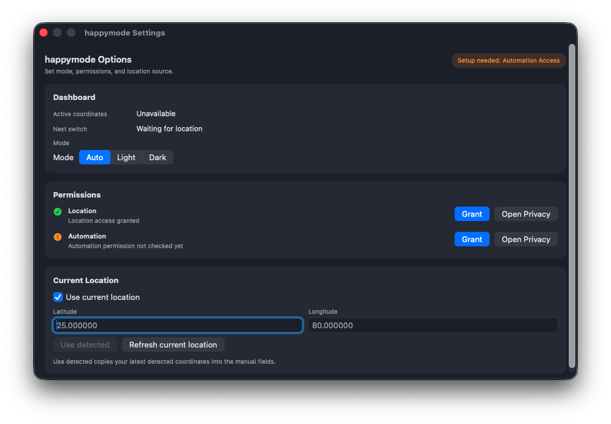

# happymode

A native macOS menu bar app that automatically switches Light/Dark appearance based on sunrise and sunset.

## What it does

- Runs as a menu bar utility (`LSUIElement`), without a Dock icon.
- Uses CoreLocation for automatic coordinates.
- Supports manual coordinate fallback and override.
- Calculates solar transitions locally (vendored Solar implementation, no network dependency).
- Applies system appearance through AppleScript (`System Events`).

## Requirements

- macOS 14.0+
- Xcode 16+
- Swift 5+

## Quick start

### Xcode

1. Open `happymode.xcodeproj`.
2. Select the `happymode` scheme.
3. Build and run.

### Terminal

```bash
xcodebuild \
  -project happymode.xcodeproj \
  -scheme happymode \
  -configuration Debug \
  -sdk macosx \
  build

open build/Debug/happymode.app
```

## Project structure

```text
happymode/
├── happymode.xcodeproj/
├── happymode/
│   ├── App/
│   │   └── HappymodeApp.swift
│   ├── Features/
│   │   ├── MenuBar/
│   │   │   └── MenuBarView.swift
│   │   └── Settings/
│   │       └── SettingsView.swift
│   ├── Core/
│   │   ├── Theme/
│   │   │   └── ThemeController.swift
│   │   └── Solar/
│   │       ├── SolarCalculator.swift
│   │       └── SolarPackage.swift
│   ├── Resources/
│   │   └── Assets.xcassets/
│   └── Config/
│       └── Info.plist
├── scripts/
│   └── create_project.rb
└── README.md
```

## Screenshots

Add screenshots to `docs/screenshots/` with these file names:

- `menu-bar.png`
- `settings.png`

Then this README will render them:




## Permissions and privacy

- `Location Services`: required only for automatic location mode.
- `Automation -> System Events`: required to apply macOS Light/Dark mode.

If location permission is denied, use manual latitude/longitude in `Options...`.

## Build and release

### Debug build

```bash
xcodebuild -project happymode.xcodeproj -scheme happymode -configuration Debug -sdk macosx build
```

### Release build

```bash
xcodebuild -project happymode.xcodeproj -scheme happymode -configuration Release -sdk macosx build
```

## Troubleshooting

- App does not switch appearance:
  - Open `Options...`, click `Grant` under Automation, and allow `happymode` in macOS Privacy settings.
- Automatic location is unavailable:
  - Grant Location permission or disable automatic location and set manual coordinates.
