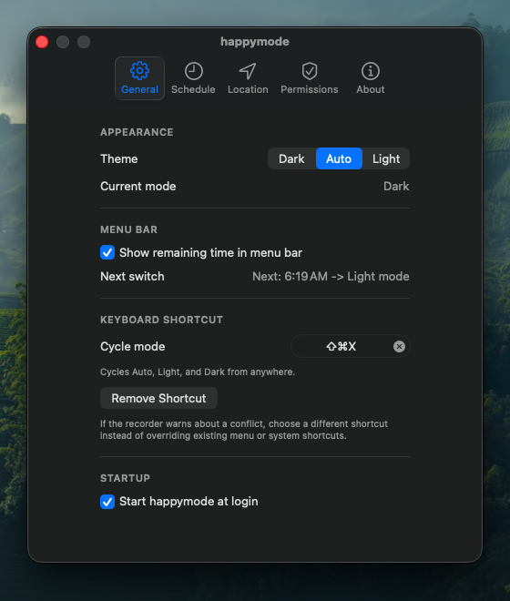

# happymode

[](https://github.com/happytoolin/happymode/actions/workflows/ci.yml)
[](https://github.com/happytoolin/happymode/actions/workflows/release.yml)
[](https://github.com/happytoolin/happymode/releases)
[](LICENSE)

Native macOS menu bar app that controls Light/Dark appearance based on sunrise/sunset or custom daily times.


## Highlights

- Menu bar utility (no Dock icon) with left-click popup and right-click context menu.
- `Auto`, `Light`, and `Dark` modes.
- Two scheduling options:
  - `Sunrise and sunset` (automatic by location or manual coordinates).
  - `Custom times` (user-defined daily switch times).
- Weekly preview of sunrise/sunset times, including polar night and midnight sun indicators.
- Optional countdown in menu bar for time remaining to next transition.
- Local solar calculations (no external API calls).
- Automatic update checking (once daily) with manual "Check for Updates" option.
- Native macOS login item integration with System Settings approval flow.
- Five settings tabs: General, Schedule, Location, Permissions, and About.

## Install

### Homebrew (recommended)

```bash
brew tap happytoolin/happytap
brew install --cask happymode
```

### Direct download

Download the latest build from [Releases](https://github.com/happytoolin/happymode/releases), then move `happymode.app` to `/Applications`.

## First launch on macOS

If Gatekeeper blocks launch, use one of these:

1. Open `System Settings -> Privacy & Security` and click `Open Anyway`.
2. Right-click `happymode.app` in `/Applications`, then click `Open`.

If needed:

```bash
xattr -dr com.apple.quarantine "/Applications/happymode.app"
```

## Usage

### Menu Bar

**Left-click** the menu bar icon to open the popup:
- Set `Mode` to `Auto`, `Light`, or `Dark`.
- In `Auto`, choose between `Sunrise and sunset` or `Custom times`.
- View next switch countdown and today's sunrise/sunset times.
- `Refresh` to force location refresh.
- `Settings…` (Cmd+,) to open settings window.
- `Quit` (Cmd+Q) to exit.

**Right-click** the menu bar icon for quick access:
- Switch between `Auto`, `Light`, and `Dark` modes.
- `Settings…` to open settings window.
- `Check for Updates…` to manually check for new releases.
- `Quit happymode` to exit.

### Settings

Open `Settings…` to configure:

- **General**: Theme picker, menu bar countdown toggle, startup at login.
- **Schedule**: Choose between sunrise/sunset or custom times, view weekly preview.
- **Location**: Automatic location detection or manual latitude/longitude coordinates.
- **Permissions**: Grant Location and Automation permissions with quick links to System Settings.
- **About**: App version, GitHub repository, website, and update check button.

### Initial Setup

1. Launch `happymode`.
2. Click the menu bar icon and set your preferred `Mode`.
3. Open `Settings…` to grant permissions:
   - **Location**: Required for automatic sunrise/sunset calculations.
   - **Automation**: Required to switch macOS appearance.
4. (Optional) Enable `Start happymode at login` in General settings.

## Screenshots





## Permissions

- **Location Services**: Required for automatic sunrise/sunset calculations. Can be disabled if using manual coordinates or custom times.
- **Automation -> System Events**: Required to apply macOS appearance changes.

Both permissions can be granted from the `Permissions` settings tab, which provides direct links to System Privacy settings. If location is denied, you can disable automatic location and set manual latitude/longitude in the `Location` settings tab.

## Development

### Requirements

- macOS 15.0
- Xcode 16+
- Swift 5.10+

### Build (Debug)

```bash
xcodebuild \
  -project happymode.xcodeproj \
  -scheme happymode \
  -configuration Debug \
  -sdk macosx \
  CODE_SIGNING_ALLOWED=NO \
  SYMROOT="$PWD/build" \
  clean build
```

### Run tests

```bash
swift test
```

## Release

Releases are automated with GitHub Actions on version tags (`v*`).

1. Merge changes to `main`.
2. Tag and push:

```bash
git tag v0.0.6
git push origin v0.0.6
```

The release workflow publishes:

- `happymode-vX.Y.Z.zip`
- `happymode-vX.Y.Z.sha256`
- `happymode-latest.zip`

To auto-update the Homebrew tap cask, set repository secret:

- `TAP_GITHUB_TOKEN` (write access to `happytoolin/homebrew-happytap`)

If this secret is missing, the release still succeeds and tap update is skipped.

## Troubleshooting

- App does not switch appearance:
  - Open `Settings…`, go to `Permissions`, grant Automation permission, and allow `happymode` under Privacy settings.
- Sunrise/sunset schedule is unavailable:
  - Grant Location permission in `Permissions`, or switch to manual coordinates/custom times in `Location` or `Schedule` settings.
- App shows warning icon in menu bar:
  - Open the popup and follow the setup guidance to grant required permissions.

## License

Licensed under [GNU GPL v3](LICENSE).
